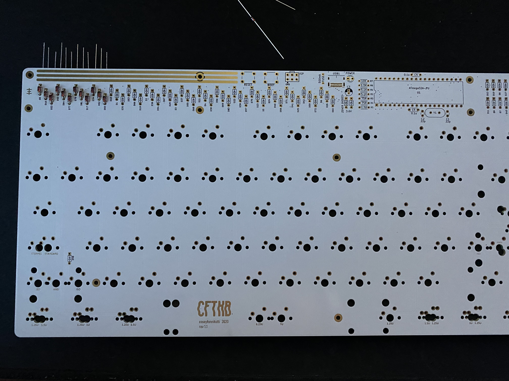
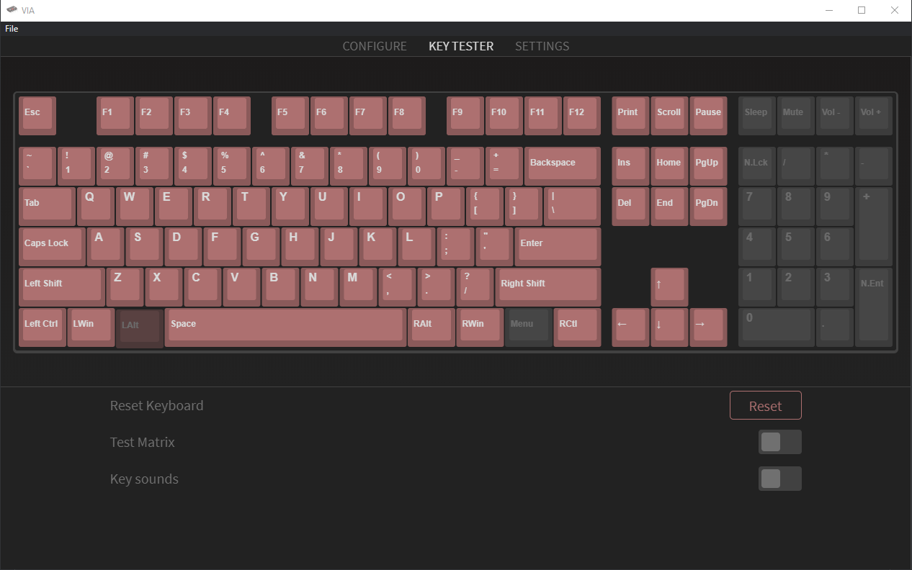
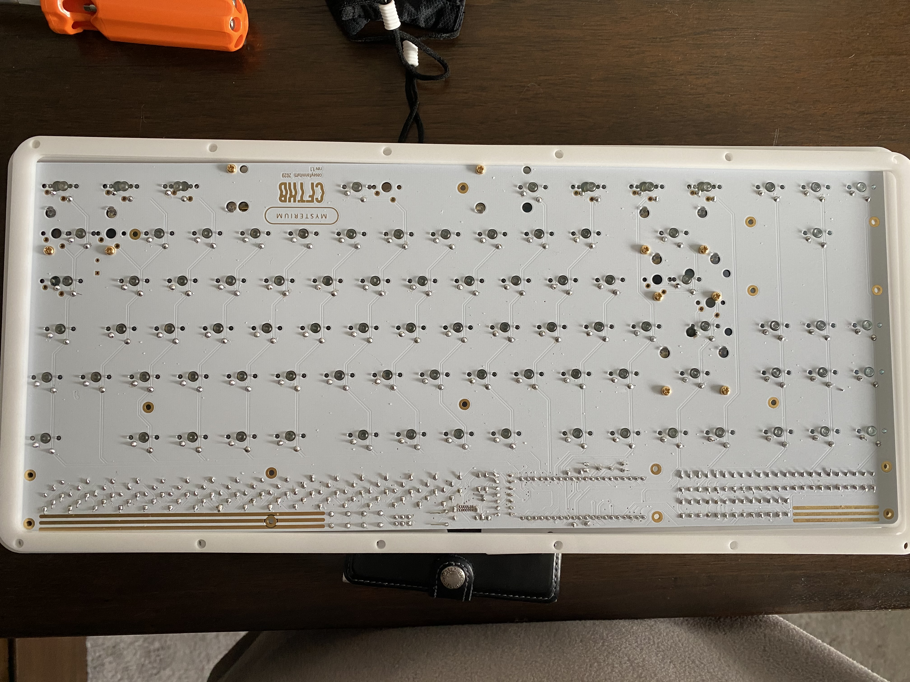
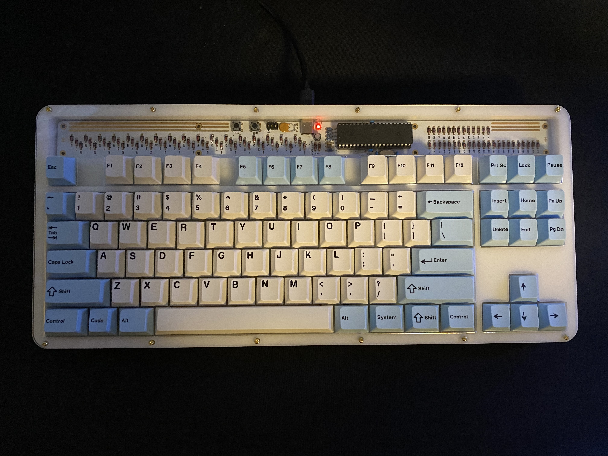

# Keyboard-Build

# Author # 
Benjamin Lokanc

# About #
My most recent project is a custom built TKL mechanical keyboard, the PCB was designed by CFTKB and the kit was ordered through them. This project served the purpose to enhance my through hole soldering skills and understand how a keyboard functions. 

# Parts List #
- Atmega32A
- 40-pin IC socket
- 16 MHz crystal 
- 2x 22pf capacitors
- 2x 0.1uF capacitors
- 4.7uF capacitor
- 2x 75ohm resistors
- 2x 1.5Kohm resistors
- 2x 5.1Kohm resistors
- 10Kohm resistor 
- 90x 1N4198 diodes
- 2x 3.6v Zener diodes
- 3mm LED
- 6-pin header
- 2x 6mm push-buttons
- USB-C port 
- 5.1mm 500mA resettable fuse 
- 32x M2 6mm screws
- 4x M2 8mm female-female standoffs
- 12x M2 14mm female-female standoffs
- 90 Zeal telios v2 linear keyboard switches. 
- 4x 2u stabalizers
- 6.25u stabalizer
- Krytox 205g0 lubricant
- drop + mito dcp pegaso custom keycap set

# Build-Process # 
This PCB is not like most other mechanical keyboard pcb's on the market. Most pcb's on the market have surface mount soldered compnents to reduce the size of the board. However, this pcb is completely through-hole soldered. 

The first step of this build was to solder all the electrical components on to the board, this part was quite tedious as there were several components.

With all electrical components soldered on the pcb, I was able to plug the keyboard into my desktop and test the PCB by shorting the switch connections. This was tested in VIA.

Once I tested each switch and found that they all worked, I got to work on the lubrication of my switches and stabalizers to have my typing experience feel more rich and smooth. This process was the longest and took me around 8 hours as it was my first time lubricating switches and I anted to make sure they werent over or underlubed. This quality assurance was to make sure each keystroke was consistent. After lubricating my stabalizers i secured them to my pcb with the included 4mm screews. 

The process that put a delay in this build was that I laser cut an acrylic case for my PCB and laser cut a new plate out of POM or delrin for my switches. When these components arrived, I was able to fit my POM plate with the lubed switches and then secure the switches to the PCB by soldering the connections. 

After this the build was nearly complete, I assembed the acrylic case and placed my keycaps on my switches. All that  was left to do was plug the keyboard into my desktop and make sure the soldered switches were working properly. With this verified, My custom mechanical keyboard was complete! 

